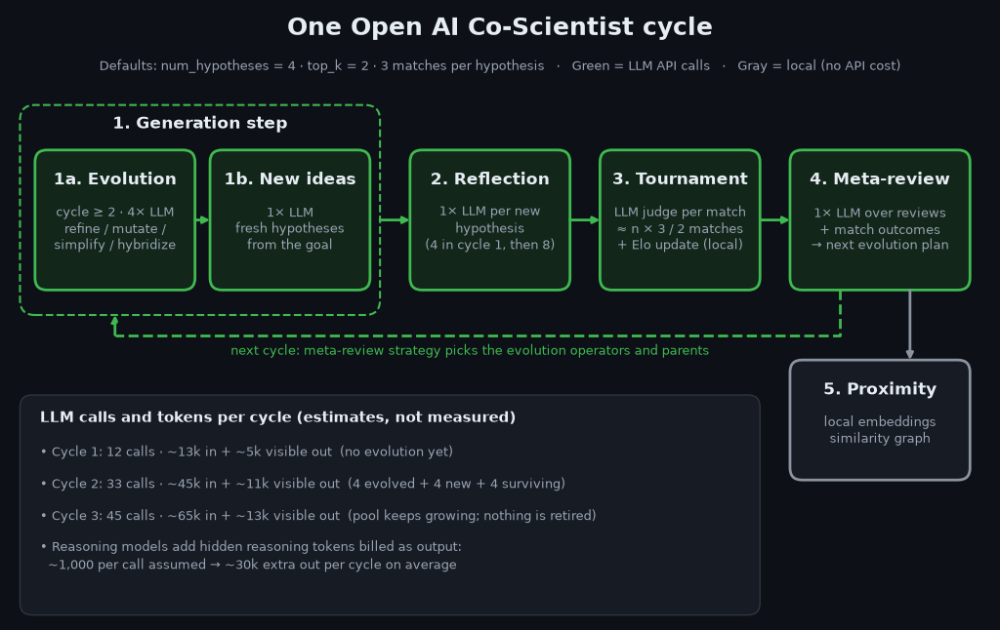
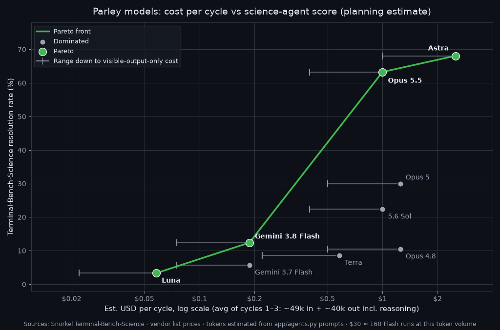

# Parley models — Terminal-Bench science ranking

Intel below is **re-ranked from public agent benchmarks**, not a subjective vibe score.

Primary source: **[Terminal-Bench-Science 0.1](https://snorkel.ai/leaderboard/terminal-bench-science/)** (scientific research workflows).  
Secondary: **[Terminal-Bench 4.0](https://snorkel.ai/leaderboard/terminal-bench-4-0/)** when Science score is missing.  
Costs remain vendor list prices (USD / 1M tokens); Parley/MIT billing may differ.

Scores are **resolution rate %** at the reported high-effort agent setting. Different harnesses/agents change absolute %; relative order is what matters here.

## What a “cycle” is

In this repo, a **cycle** is one click of **Run Cycle** in the Gradio UI: one full Open AI Co-Scientist pipeline pass for your research goal.

With default `num_hypotheses: 4`, a cycle is roughly **up to 4 evolution LLM calls (from cycle 2 on) + 1 generation + reflections on new (not yet reviewed) hypotheses + one tournament + 1 meta-review**. The tournament makes about `n × tournament_matches_per_hypothesis / 2` judge calls for `n` active hypotheses (default 3 matches each), up to `n × 3`. Cycle 1 (4 fresh hypotheses) is about 12 LLM calls; cycle 2 (4 evolved + 4 fresh + 4 surviving) is about 35. Proximity remains mostly local.  
“Cycles on $30” in the cost table = how many of these Run Cycle passes fit under the token-budget assumption below.

## Cost vs science scatter (co-scientist use case)

Assumes one cycle uses roughly **80k input + 32k output** tokens (planning estimate; likely high vs ~6 real calls).  
X = estimated USD / cycle. Y = Terminal-Bench-Science resolution %.  
**★** = Pareto front (maximize science, minimize $/cycle). Only **measured** TB-Science points define the front.

| Model | TB-Science | $ / cycle | Cycles on $30 | Pareto |
| --- | ---: | ---: | ---: | --- |
| `gpt-5.6-luna` | 3.3% | $0.05 | ~554 | ★ cheapest |
| `gemini-3.8-flash` | 12.4% | $0.18 | ~166 | ★ best for ~$30 |
| `gpt-5.6-terra` | 8.6% | $0.54 | ~55 | dominated by Flash |
| `gpt-5.6-sol` | 22.4% | $0.96 | ~31 | dominated by Opus 5.5 |
| `claude-opus-5-5` | 63.3% | $0.96 | ~31 | ★ best quality before Astra |
| `claude-opus-5` | 30.0% | $1.20 | ~25 | dominated |
| `claude-opus-4-8` | 10.5% | $1.20 | ~25 | dominated |
| `gemini-3.7-flash` | 5.7% | $0.18 | ~166 | dominated by 3.8 Flash |
| `gpt-6-astra` | 68.1% | $2.40 | ~12 | ★ highest science |

### Scatter plot

Pareto polyline (left → right): **Luna → Gemini 3.8 Flash → Claude Opus 5.5 → GPT-6 Astra**.

**Pick on ~$30:** stay at `gemini-3.8-flash` on the front (~166 cycles). Jump to `claude-opus-5-5` only if you need much higher measured science (~31 cycles). Skip `gpt-6-astra` until budget grows.

PNG path: `docs/parley-cost-science-pareto.png`. Interactive version: Cursor canvas `parley-models.canvas.tsx`.

## Ranked chat models (your Parley IDs)

| Rank | Model ID | Intel | TB-Science | TB 4.0 | In / Out per 1M | Notes |
| ---: | --- | ---: | ---: | ---: | ---: | --- |
| 1 | `gpt-6-astra` | **5** | **68.1%** | ~58% | $10 / $50 | Best on TB-Science; burns $30 fast |
| 2 | `claude-opus-5-5` | **5** | **63.3%** | ~66%* | $4 / $20 | Close #2 on science agents |
| 3 | `claude-opus-5` | **4** | **30.0%** | ~54% | $5 / $25 | Strong science; expensive |
| 4 | `gpt-5.6-sol` | **4** | **22.4%** | ~37% | $4 / $20 | Best OpenAI mid-frontier on science |
| 5 | `claude-opus-4-8` | **3** | **10.5%** | ~24% | $5 / $25 | Mid pack on TB-Science |
| 6 | `gemini-3.8-flash` | **3** | **12.4%** | ~19% | $0.75* / $3.75* | Best cheap science pick on your list |
| 7 | `gpt-5.6-terra` | **3** | **8.6%** | ~22% | $2 / $12 | Balanced, modest science score |
| 8 | `gemini-3.7-flash` | **2** | **5.7%** | ~11% | $0.75* / $3.75* | Cheaper Flash; weaker science |
| 9 | `gpt-5.6-luna` | **2** | **3.3%** | ~17% | $0.20 / $1.20 | Cheap; weak on TB-Science |
| — | `claude-sonnet-5-5` | **4†** | — | ~70%* | $2 / $10 | No TB-Science row yet; very strong TB 4.0 |
| — | `gpt-6-sol` | **4†** | — | — | $2 / $10 | No TB-Science row; expect below Astra |
| — | `gpt-6-luna` | **2†** | — | — | $0.10 / $0.50 | No TB-Science row; expect ~Luna tier |
| — | `claude-sonnet-5` | **2†** | — | ~12% | $2 / $10 | Weak TB 4.0 vs Opus/Astra |
| — | `claude-sonnet-4-6` | **2†** | — | — | $3 / $15 | Older Sonnet; no TB-Science score |
| — | `claude-opus-4-7` | **3†** | — | — | $5 / $25 | Assume near Opus 4.8 |
| — | `gpt-5.5` | **3†** | — | — | $5 / $30 | Strong GPQA; no TB-Science score |
| — | `gpt-5.4` / `gpt-5.3-codex` / `gpt-5.2` / `gpt-5.1` / `gpt-5` | **2–3†** | — | — | see below | Older GPT-5 line; not on TB-Science board |
| — | `gpt-5.4-mini` / `gpt-5-mini` | **2†** | — | — | cheap | Fine for app smoke tests, not science agents |
| — | `gpt-5.4-nano` / `gpt-5-nano` / `claude-haiku-4-5` / `gemini-3.5-flash-lite` | **1†** | — | — | cheapest | Throughput only |
| — | `gemini-3.1-pro` / `gemini-3.5-flash` / `gemini-3.0-flash` / `gemini-2.5-pro` | **2–3†** | — | — | mid | Not on TB-Science board (3.8 Flash is) |
| — | `llama-4-maverick-17b` | **1†** | — | — | ~$0.24 / $0.97 | No TB-Science score |

\* Gemini Flash intro pricing thru 2026-12-31; vendor TB 4.0 / Anthropic self-reports can differ from Snorkel official board.  
† Estimated from nearby family + TB 4.0 / GPQA; **not** a measured TB-Science score.

## If you only have ~$30

| Priority | Model | Why |
| --- | --- | --- |
| **Best science / $** | `gemini-3.8-flash` | Measured 12.4% TB-Science, cheap intro rates |
| **Best measured quality in budget** | `claude-sonnet-5-5` | No Science score yet, but top-tier TB 4.0 at $2/$10 |
| **Avoid on $30** | `gpt-6-astra`, `claude-opus-5*`, `gpt-5.5` | High $/token; few cycles |

## Older GPT pricing (not on TB-Science)

| Model | In / Out |
| --- | --- |
| `gpt-5.4` | $2.50 / $15 |
| `gpt-5.4-mini` | $0.75 / $4.50 |
| `gpt-5.4-nano` | $0.20 / $1.25 |
| `gpt-5.3-codex` | $1.75 / $14 |
| `gpt-5.2` | $1.75 / $14 |
| `gpt-5.1` / `gpt-5` | $1.25 / $10 |
| `gpt-5-mini` | $0.25 / $2 |
| `gpt-5-nano` | $0.05 / $0.40 |

## Not for chat cycles

| Model ID | Kind |
| --- | --- |
| `text-embedding-3-small` | embeddings |
| `amazon-titan-embed-text-v2-0` | embeddings |
| `gemini-embedding-2` | embeddings |
| `gpt-image-1` / `gpt-image-2` | image |

## Caveats

1. TB-Science measures **terminal scientific workflows with an agent harness** (Codex / Claude Code / etc.). This Gradio app is multi-step hypothesis chat, not the same task — but it’s the closest public science-agent ranking.
2. Absolute % depends on agent + effort; compare models within the same board.
3. Sources: Snorkel Terminal-Bench-Science / Terminal-Bench 4.0 leaderboards (as of ~Oct 2026).
